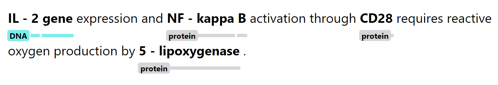
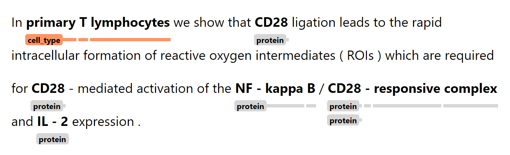

<!-- SPACY PROJECT: AUTO-GENERATED DOCS START (do not remove) -->

# 🪐 spaCy Project: Comparing SpanCat and NER using a corpus of biomedical literature (GENIA)

This project demonstrates how spaCy's Span Categorization (SpanCat) and
Named-Entity Recognition (NER) perform on different types of entities. Here, we used
a dataset of biomedical literature containing both overlapping and non-overlapping spans.

## 📋 project.yml

The [`project.yml`](project.yml) defines the data assets required by the
project, as well as the available commands and workflows. For details, see the
[spaCy projects documentation](https://spacy.io/usage/projects).

### ⏯ Commands

The following commands are defined by the project. They
can be executed using [`spacy project run [name]`](https://spacy.io/api/cli#project-run).
Commands are only re-run if their inputs have changed.

| Command | Description |
| --- | --- |
| `download` | Download model-related assets |
| `convert` | Convert IOB file into the spaCy format |
| `create-ner` | Split corpus into separate NER datasets for each GENIA label |
| `train-ner` | Train an NER model for each label |
| `train-spancat` | Train a SpanCat model |
| `evaluate-ner` | Evaluate all NER models |
| `assemble-ner` | Assemble all NER models into a single pipeline |
| `evaluate-spancat` | Evaluate SpanCat model |

### ⏭ Workflows

The following workflows are defined by the project. They
can be executed using [`spacy project run [name]`](https://spacy.io/api/cli#project-run)
and will run the specified commands in order. Commands are only re-run if their
inputs have changed.

| Workflow | Steps |
| --- | --- |
| `all` | `download` &rarr; `convert` &rarr; `create-ner` &rarr; `train-ner` &rarr; `assemble-ner` &rarr; `train-spancat` &rarr; `evaluate-ner` &rarr; `evaluate-spancat` |
| `spancat` | `download` &rarr; `convert` &rarr; `train-spancat` &rarr; `evaluate-spancat` |
| `ner` | `download` &rarr; `convert` &rarr; `create-ner` &rarr; `train-ner` &rarr; `evaluate-ner` &rarr; `assemble-ner` |

### 🗂 Assets

The following assets are defined by the project. They can
be fetched by running [`spacy project assets`](https://spacy.io/api/cli#project-assets)
in the project directory.

| File | Source | Description |
| --- | --- | --- |
| `assets/train.iob2` | URL | The training dataset for GENIA in IOB format. |
| `assets/dev.iob2` | URL | The evaluation dataset for GENIA in IOB format. |
| `assets/test.iob2` | URL | The test dataset for GENIA in IOB format. |

<!-- SPACY PROJECT: AUTO-GENERATED DOCS END (do not remove) -->

### About the dataset

[GENIA](http://www.geniaproject.org/genia-corpus) is a dataset containing
biomedical literature from 1,999 Medline abstracts. It contains a collection
of overlapping and hierarchical spans. To make parsing easier, we will be
using the [pre-constructed IOB
tags](https://github.com/thecharm/boundary-aware-nested-ner/blob/master/Our_boundary-aware_model/data/genia)
from the [Boundary Aware Nested NER
paper](https://aclanthology.org/D19-1034/)
[repository](https://github.com/thecharm/boundary-aware-nested-ner/). Running `debug data` gives us the
following span characteristics (**SD** = Span Distinctiveness, **BD** = Boundary Distinctiveness):

| Span Type | Span Length | SD                   | BD                       |
|-----------|-------------|----------------------|--------------------------|
| DNA       | 2.81        | 1.45                 | 0.80                     |
| protein   | 2.19        | 1.19                 | 0.57                     |
| cell_type | 2.09        | 2.35                 | 1.05                     |
| cell_line | 3.29        | 1.91                 | 1.04                     |
| RNA       | 2.73        | 2.68                 | 1.28                     |

The table above shows the average span length for each span type, and their
corresponding distinctiveness characteristics. The latter is computed using
the KL-divergence of the span's token distribution with respect to the overall
corpus's. The higher the number is, the more distinct the tokens are compared to the
rest of the corpus.

These characteristics can give us a good intuition as to how well the SpanCat
model identify the correct spans. In the case of GENIA, the entities
themselves tend to be technical terms, which makes it more distinct and easier
to classify. Again, we measure distinctiveness not only within the entities
themselves (SD), but also in its boundaries (BD).

Here's some example data:

### Experiments

Given what we know from the dataset, we will create the following pipelines:

| Pipeline | Description                                                                                                                             | Workflow Name |
|----------|-----------------------------------------------------------------------------------------------------------------------------------------|---------------|
| SpanCat  | Pure Span Categorization for all types of entities. Serves as illustration to demonstrate suggester functions and as comparison to NER. | `spancat` |
| NER      | Named-Entity Recognition for all types of entities. Serves as illustration to compare with the pure SpanCat implementation       | `ner`         |

#### SpanCat Results

Below are the results for SpanCat. It seems that overall, span categorization
is biased towards precision. This means that a large number of the suggested
spans belong to the correct class. We can always tune how precise we want it
to be: make the suggester lenient and we might get a lot of irrelevant hits,
make it strict and we miss might out on some true positives.

|           | Precision   | Recall   | F-score   |
|-----------|-------------|----------|-----------|
| DNA       |    0.70     | 0.36     |  0.47     |
| protein   |    0.77     | 0.52     |  0.62     |
| cell_line |    0.77     | 0.30     |  0.44     |
| cell_type |    0.76     | 0.62     |  0.68     |
| RNA       |    0.77     | 0.25     |  0.38     |
| **Overall**| 0.76       | 0.47     |  0.58     |

#### NER Results

NER performs well against SpanCat for all entity types, but note that this
process entails training five (5) models per entity type. This might work if
you have a small number of entities, but can be computationally heavy if you
have a lot.

|           |   Precision | Recall |   F-score |
|-----------|-------------|--------|-----------|
| DNA       |    0.74     | 0.63   |  0.68     |
| protein   |    0.76     | 0.72   |  0.74     |
| cell_line |    0.74     | 0.57   |  0.64     |
| cell_type |    0.78     | 0.72   |  0.75     |
| RNA       |    0.86     | 0.65   |  0.74     |

Since we have five (5) separate models in NER, what we can do afterwards is
combine them into a single `Doc` that transfers `doc.ents` to `doc.spans`. Since
the tokens are the same, we don't need to worry about misalignments and the like.
