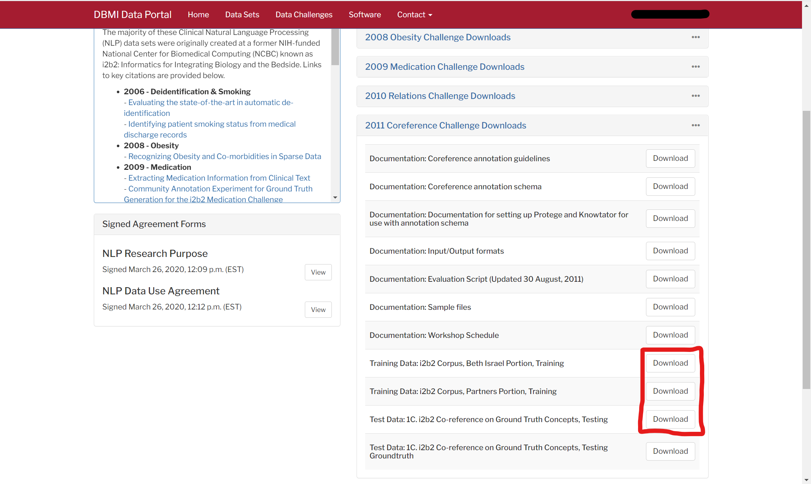

<!-- SPACY PROJECT: AUTO-GENERATED DOCS START (do not remove) -->

# 🪐 spaCy Project: Detecting entities in Medical Records with PyTorch

This project uses the [i2b2 (n2c2) 2011 Challenge Dataset](https://portal.dbmi.hms.harvard.edu/projects/n2c2-nlp/) to bootstrap a PyTorch NER model to detect entities in Medical Records. It also demonstrates how to anonymize medical records for annotators in [Prodigy](https://prodi.gy).

## 📋 project.yml

The [`project.yml`](project.yml) defines the data assets required by the
project, as well as the available commands and workflows. For details, see the
[spaCy projects documentation](https://spacy.io/usage/projects).

### ⏯ Commands

The following commands are defined by the project. They
can be executed using [`spacy project run [name]`](https://spacy.io/api/cli#project-run).
Commands are only re-run if their inputs have changed.

| Command | Description |
| --- | --- |
| `preprocess` | Convert the data to spaCy's binary format |
| `train` | Train a custom PyTorch named entity recognition model |
| `train-trf` | Train a custom PyTorch named entity recognition model with transformer |
| `evaluate` | Evaluate the custom PyTorch model and export metrics |
| `package` | Package the trained model so it can be installed |
| `visualize-model` | Visualize the model's output interactively using Streamlit |

### ⏭ Workflows

The following workflows are defined by the project. They
can be executed using [`spacy project run [name]`](https://spacy.io/api/cli#project-run)
and will run the specified commands in order. Commands are only re-run if their
inputs have changed.

| Workflow | Steps |
| --- | --- |
| `all` | `preprocess` &rarr; `train` &rarr; `evaluate` |

### 🗂 Assets

The following assets are defined by the project. They need to manually downloaded. See the Data below for more details.

| File | Source | Description |
| --- | --- | --- |
| [`assets/n2c2_2011/i2b2_Beth_Train_Release.tar.gz`](assets/n2c2_2011/i2b2_Beth_Train_Release.tar.gz) | Local | Tarfile containing original challenge data from the Beth training data split |
| [`assets/n2c2_2011/i2b2_Partners_Train_Release.tar.gz`](assets/n2c2_2011/i2b2_Partners_Train_Release.tar.gz) | Local | Tarfile containing original challenge data from the Partners training data split |
| [`assets/n2c2_2011/Task_1C.zip`](assets/n2c2_2011/Task_1C.zip) | Local | Zipfile containing original challenge test data |

<!-- SPACY PROJECT: AUTO-GENERATED DOCS END (do not remove) -->

---

## PyTorch + spaCy

There are several spaCy project examples that show the integration of Transformers in spaCy models. These examples already use PyTorch through the spacy-transformers to encode spaCy docs as vector representations while using Thinc as task-specific model heads. 

The goal for this tutorial is to show how to use a PyTorch (or other ML framework) end-to-end, from encoding vector representations, to building a task specific model head for Named Entity Recognition.

For more details on using external ML frameworks in spaCy see:
https://spacy.io/usage/layers-architectures#frameworks


## 📚 Data

The main data source is the i2b2 2011 Co-Reference Challenge Dataset. This dataset has annotations for Named Entity Recognition in Medical Records and co-references between each entity. For the purpose of this tutorial, we focus solely on extracting the labeled entities.

There are no downloadable spacy assets for this project due to the User Agreement for the Dataset. In order to use this data, you must create an account through the [Harvard DBMI Portal](https://portal.dbmi.hms.harvard.edu/projects/n2c2-nlp/).

Once you have an account, navigate to the n2c2 NLP Datasets page. https://portal.dbmi.hms.harvard.edu/projects/n2c2-nlp/.

> Once you sign up and request an account, from experience you should get a response in the next 6 hours.

Under the 2011 Coreference Challenge Downloads section,Download the Beth Israel Portion, Partners Portion, and Test Data to the `assets/n2c2_2011` folder. 



Your `assets/n2c2_2011` should look like this after download:

```
assets
└─── n2c2_2011
        i2b2_Beth_Train_Release.tar.gz
        i2b2_Partners_Train_Release.tar.gz
        Task_1.zip
```

Once you have this data downloaded, the `preprocess` project command will build `*.spacy` dataset files for you.

The data is separated into the following splits:


| Name | Description | N Examples |
|------|-------------|------------|
| train.spacy | 80% of official train data (combining Beth and Partners training data splits) | 200 |
| dev.spacy  | 20% of official train data (combining Beth and Partners training data splits) | 51 |
| test.spacy | Official test data (combining Beth and Partners test data splits) | 173 |


### Using PyTorch with a different open dataset

If you simply want to experiment with the PyTorch NER model and don't want to bother creating an account to get the i2b2 data, you can pull data from any of the other example tutorial [projects](https://github.com/explosion/projects/tree/v3/tutorials) that have the `ner_` prefix.

For example, open the `ner_fashion_brands` project and run the commands to download and preprocess the provided data.

1. Download fashion brand assets.
```bash
# /path/to/projects/tutorials/ner_fashion_brands 
$ spacy project assets
```

2. Run the ner_fashion_brands preprocess command to output `.spacy` files
```bash
# /path/to/projects/tutorials/ner_fashion_brands 
$ spacy project run preprocess
```

This will output a train and dev file to the `corpus` directory. 

```
projects
└─── tutorials
    └─── ner_fashion_brands
        └─── corpus
                train.spacy
                dev.spacy
```

3. Copy the `corpus` folder to the `ner_pytorch_medical` project directory and the `train` + `evaluate` commands should work!


After copying the data, you should have the files:

```
projects
└─── tutorials
    └─── ner_pytorch_medical
        └─── corpus
                train.spacy # ner_fashion_brands train data
                dev.spacy # ner_fashion_brands dev data
```

4. Train a PyTorch model with 

```bash
spacy project run train 
# Or for transformer training, spacy project run train-trf
```

## 🧮 Results

We've tested 4 configurations which have been saved to the `configs` folder. All models were evaluated by F1 Score on the official i2b2 test data created by the `preprocess` command as `test.spacy`.

| Model | Config | Description | F1 Score (test.spacy) |
|-------|--------|-------------|----------|
| spaCy + Vectors | `configs/spacy_config.cfg` | spaCy `ner` model with static vectors from `en_core_web_lg` | 67.54 |
| PyTorch + Vectors | `configs/config.cfg` | PyTorch based `torch_ner` pipeline with static vectors from `en_core_web_lg` | 62.69 |
| spaCy + Transformer | `configs/spacy_config_trf.cfg` |spaCy `ner` model with Transformer `roberta-base` | 75.20 |
| PyTorch + Transformer | `configs/config_trf.cfg` | PyTorch based `torch_ner` pipeline with Transformer `roberta-base` | **78.07** |


## Annotate new data with Prodigy

The i2b2 data comes from medical records with all personal health information already removed. 

> **Personal health information (PHI)** is information like patient names, medical ID numbers, Social Security numbers, etc. 

Imagine we want to update our trained model with new medical records. With medical data, it's imperative to retain patient privacy. That being said, we could use the standard `ner` Prodigy workflows to improve our model, however we would have to have a separate process where someone goes through all the records we want to annotate and remove all personal health information present. 

To improve this manual workflow, we've added a new custom Prodigy recipe that will anonymize medical records for annotators as data is loaded into Prodigy. 

The identification of personal health information is handled by the PII Endpoint of the [Azure Text Analytics Entity Recognition API](https://github.com/MicrosoftDocs/azure-docs/blob/master/articles/cognitive-services/text-analytics/includes/create-text-analytics-resource.md) wrapped in a custom spaCy pipeline component here: `scripts/azure/azure_ner_pipe.py`

### Why use Azure Text Analytics?

You might be wary of sending this private medical data to an external endpoint. 

However, Microsoft Azure is fully HIPPA compliant (for US) and having worked on the Cognitive Services team I can attest to the fact that no user data is ever stored from the Text Analytics endpoint and never will be. Also, as a US based organization you can enter an official Business Associate Agreement with Azure that ensures data protection and compliance for covered organizations. Read more about [Microsoft Hippa Compliance Offer](https://docs.microsoft.com/en-us/azure/compliance/offerings/offering-hipaa-us).

PII Removal is a nuanced task with a lot of edge cases. While it may be more private to handle this manually and internally, if you are going to automate the process, it's a good case for using a big company's cloud service to offload responsibilty to a larger team with resources to think about all the edge cases and oversight from a compliance department.

> If you still don't want to use Azure Text Analytics for data anonymization, you can adapt this recipe to use Presidio, an open source project by Microsoft: https://github.com/microsoft/presidio 

### Anonymization in action

This recipe takes an opinionated approach to anonymization. Before examples are shown to the annotator in Prodigy, we run the Azure Entity Recognizer to extract PII entities, then we replace tokens in Prodigy with their shape (similar to how spaCy's built-in `token.shape_` works), while retaining the original text and tokens to send to the model update.


So for a simple mock note:

```
Name: Kabir Khan
Date: 2022-01-01
SSN: 444-44-4444

Information: Patient scheduled for surgery to repair tear in left ACL.
```

The anonymized text shown to the annotator would look like:

```
Name: Xxxxx Xxxx
Date: dddd-dd-dd
SSN: ddd-dd-dddd

Information: Patient scheduled for surgery to repair tear in left ACL.
```

This approach retains all the structure and character offsets into the original note during annotation. Once the annotator accepts the example and the internal Prodigy `update` method is called to update our model in the loop, we send the original text instead of the anonymized text.


### Running the example annotation workflow

1. Sign Up for an Azure Account and Create a Cognitive Services resource. Steps detailed under Prerequisites [here](https://docs.microsoft.com/en-us/azure/cognitive-services/text-analytics/quickstarts/client-libraries-rest-api?tabs=version-3-1&pivots=programming-language-csharp)

> You want to create a general Cognitive Services resource, not the specific service for Text Analytics

2. Get your API keys and determine which region your service is in.


3. Update the Cognitive Services Key and Base URL under the project.yml vars.

```yaml
vars:
  ...
  azure:
    text_analytics_key: "YOUR_API_KEY"
    text_analytics_base_url: "https://westus2.api.cognitive.microsoft.com/"
```

4. Run the `annotate` command

```
spacy project run annotate
```

> NOTE: To avoid adding a reference to your private API key in the project.yml, you can skip step 3 and provide the text_analytics_key via the CLI

> e.g.
> ```bash
> spacy project run annotate --vars.azure.text_analytics_key "YOUR_API_KEY"
> ```
