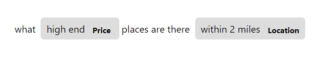
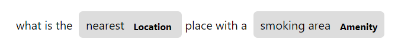

<!-- SPACY PROJECT: AUTO-GENERATED DOCS START (do not remove) -->

# 🪐 spaCy Project: Using SpanRuler for rule-based Named Entity Recognition

This example project demonstrates how you can use the
[SpanRuler](https://spacy.io/api/spanruler), a component introduced in spaCy
3.3, for rule-based named entity recognition (NER). In spaCy v3 and below,
this functionality can be achieved via the
[EntityRuler](https://spacy.io/api/entityruler). However, we will start
**deprecating** the `entity_ruler` component in favor of `span_ruler` in v4.

Here, we will be using the **MIT Restaurant dataset** (Liu, et al, 2013) to
determine entities such as *Rating*, *Location*, *Restaurant_Name*,
*Price*, *Dish*, *Amenity*,  and *Cuisine* from restaurant reviews.
Below are a few examples from the training data:

First, we will train an NER-only model and treat it as our baseline. Then, we
will attach the `SpanRuler` component **after the `ner` component** of the
existing pipeline. This setup gives us two pipelines we can compare upon. The
rules for each entity type can be found in the `scripts/rules.py` file.

If we look at the results, we see an increase in performance for the majority
of entities with rules:

|          | NER only  | With Spanruler  |
|----------|-----------|-----------------|
| Price    | 81.68     | **83.23**       |
| Rating   | 78.42     |   78.06         |
| Hours    | 64.91     | **65.80**       |
| Amenity  | 64.26     | **64.96**       |
| Location | 82.28     | **82.82**       |
| Restaurant_Name| 76.88     | **78.92**       |

Overall, we have better performance for the combined `ner` and `span_ruler`
pipeline with our set of rules.

|           | NER only | With Spanruler |
|-----------|----------|----------------|
| Precision | 76.39    | **77.06**      |
| Recall    | 76.64    | **77.40**      |
| F-score   | 76.52    | **77.23**      |

When we noticed some inconsistencies in the original dataset, we went back and
fixed them with a [Prodigy](https://prodi.gy) workflow. The commands are included
here to reproduce our process for annotation, but we've also included the outputted
datasets so you can directly skip to training a new model. 

With the new annotations and rules, we saw an improvement in both the NER and NER with 
Spanruler pipelines.

|          | NER only  | With Spanruler  |
|----------|-----------|-----------------|
| Price    | 87.00     | **87.25**       |
| Rating   | 89.39     | **92.55**       |
| Hours    | 82.12     | **82.52**       |
| Amenity  | 80.95     | **83.07**       |
| Location | 92.03     | **92.70**       |
| Restaurant_Name| 82.90     | **87.48**       |
| Cuisine  | 90.00     | **91.09**       |
| Dish     | 83.05     | **85.66**       |

Overall, we have better performance for the combined `ner` and `span_ruler`
pipeline with our new set of rules.

|           | NER only | With Spanruler |
|-----------|----------|----------------|
| Precision | 87.05    | **88.86**      |
| Recall    | 86.31    | **88.10**      |
| F-score   | 86.68    | **88.48**      |

**Reference**

- J. Liu, P. Pasupat, S. Cyphers, and J. Glass. 2013. Asgard: A portable
architecture for multilingual dialogue systems. In *2013 IEEE International
Conference on Acoustics, Speech and Signal Processing*, pages 8386-8390

## 📋 project.yml

The [`project.yml`](project.yml) defines the data assets required by the
project, as well as the available commands and workflows. For details, see the
[spaCy projects documentation](https://spacy.io/usage/projects).

### ⏯ Commands

The following commands are defined by the project. They
can be executed using [`spacy project run [name]`](https://spacy.io/api/cli#project-run).
Commands are only re-run if their inputs have changed.

| Command | Description |
| --- | --- |
| `download` | Download a spaCy model with pretrained vectors. |
| `preprocess` | Preprocess the raw IOB, convert them into spaCy format, and split them into train, dev, and test partitions. |
| `train` | Train a baseline NER model. |
| `assemble` | Assemble trained NER pipeline with SpanRuler. |
| `evaluate` | Evaluate each model. |
| `preprocess-prodigy` | Preprocess raw IOB data into JSONL format for Prodigy review recipe. |
| `db-in` | Add datasets to Prodigy database. |
| `prodigy-review-train` | Annotate the train data with the Prodigy review recipe. |
| `prodigy-review-test` | Annotate the test data with the Prodigy review recipe. |
| `db-out` | Export Prodigy data. |
| `prodigy-convert` | Convert Prodigy files into spaCy's binary format for model training. |
| `train-review` | Train a NER model with reviewed data. |
| `assemble-review` | Assemble trained NER pipeline with SpanRuler with reviewed data. |
| `evaluate-review` | Evaluate each model with reviewed data. |

### ⏭ Workflows

The following workflows are defined by the project. They
can be executed using [`spacy project run [name]`](https://spacy.io/api/cli#project-run)
and will run the specified commands in order. Commands are only re-run if their
inputs have changed.

| Workflow | Steps |
| --- | --- |
| `all` | `download` &rarr; `preprocess` &rarr; `train` &rarr; `assemble` &rarr; `evaluate` |
| `prodigy` | `preprocess-prodigy` &rarr; `db-in` |
| `review` | `prodigy-convert` &rarr; `train-review` &rarr; `assemble-review` &rarr; `evaluate-review` |

### 🗂 Assets

The following assets are defined by the project. They can
be fetched by running [`spacy project assets`](https://spacy.io/api/cli#project-assets)
in the project directory.

| File | Source | Description |
| --- | --- | --- |
| `assets/train_raw.iob` | URL | Training data from the MIT Restaurants Review dataset |
| `assets/test_raw.iob` | URL | Test data from the MIT Restaurants Review dataset |
| [`assets/train_review.jsonl`](assets/train_review.jsonl) | Local | JSONL-formatted training data exported from Prodigy (7662 examples) |
| [`assets/test_review.jsonl`](assets/test_review.jsonl) | Local | JSONL-formatted test data exported from Prodigy (1521 examples) |

<!-- SPACY PROJECT: AUTO-GENERATED DOCS END (do not remove) -->
